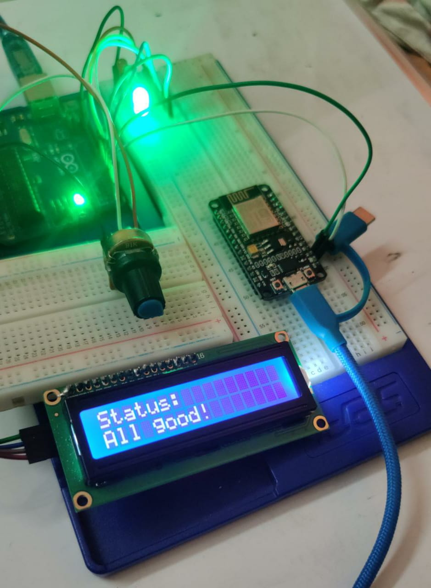
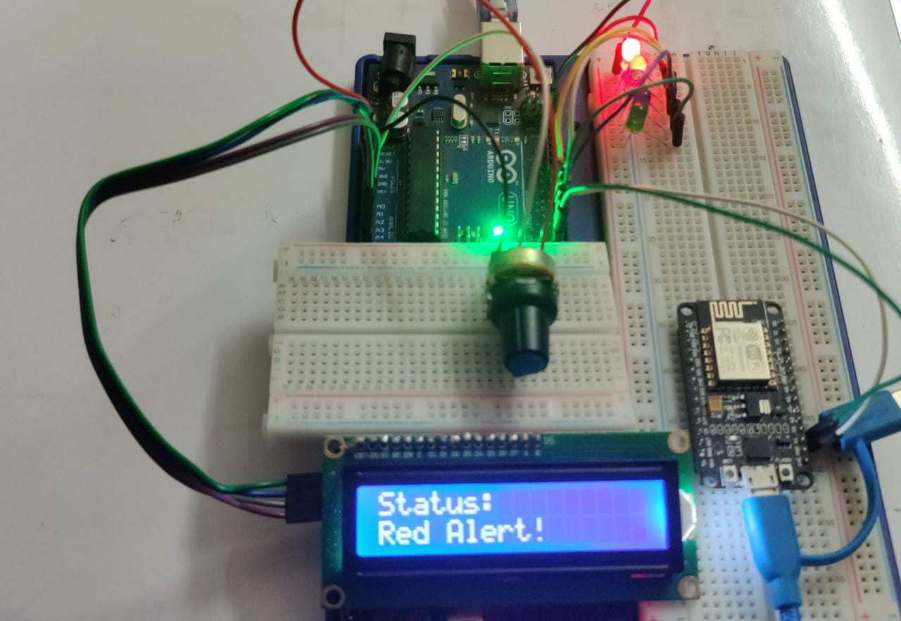
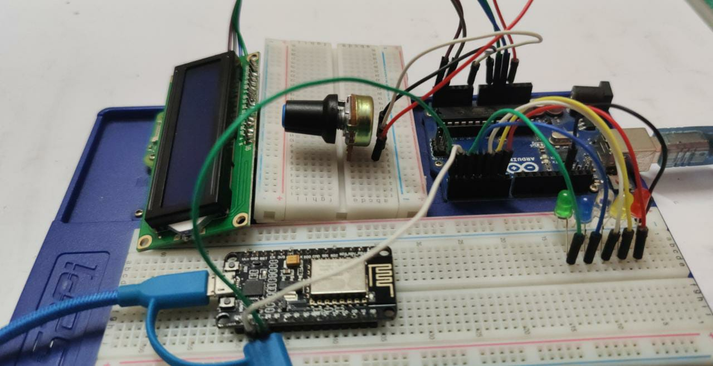
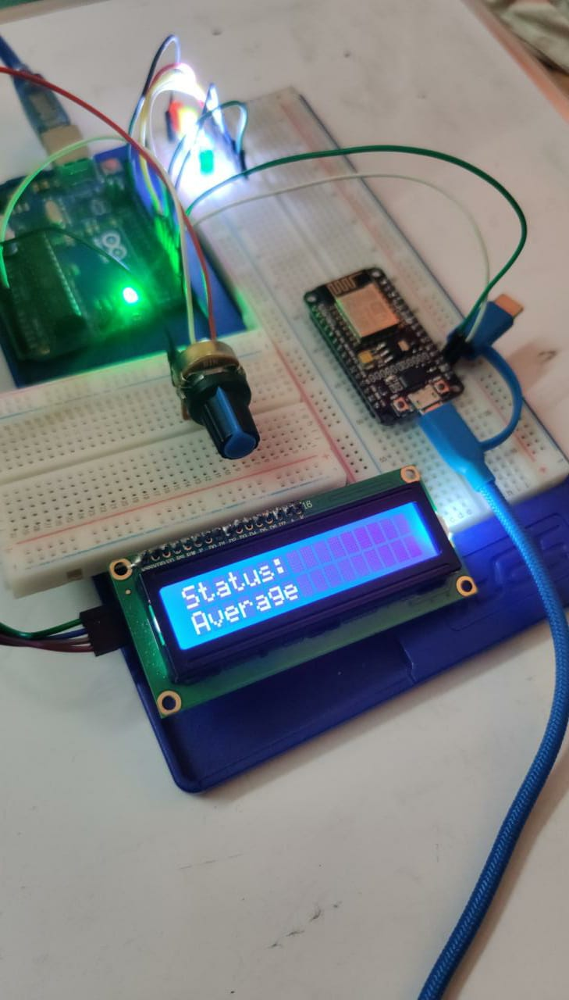

# Hacknado
Official submission to MLH's Hacknado

## Inspiration💡
One of our teammates is from Odisha, a state in India that sustains the most catastrophic damages associated with cyclones in the country pretty much every year. He came up with the idea to build a personal, compact weather station that could potentially be used by general public which would alert the residents of any upcoming storms taking into consideration the common weather metrics. This apparatus can also be used by relief teams in order to ensure their safety by constantly monitoring remote weather changes whilst navigating through the storm to help affected citizens.

## What it does 🧭
Unlike the name, Cycloninator doesn't actually spin up cyclones but helps with timely detection of upcoming storms with the use of right sensors and instruments of measure. A Weather Station consists of instruments like anemometer, wind vane, pressure sensor, thermometer, hygrometer, and rain gauge. Our aim is to emulate something similar and make it compact for people to have a small weather stations inside their homes.

## How we built it 🔧
We used a potentiometer connected to an Arduino board to emulate the array of sensors/instruments that would ideally be attached to the apparatus. The potentiometer throws a value that is segregated by the board into 5 categories, indicating if the weather is good or bad. An LCD display attached to the board along with the multiple LEDs notify the User if it's safe to step outside given the current weather.

Additionally, the data is being sent to a database using Google Cloud Functions and Firestore and we are harnessing the capabilities of Twilio to send the user notifications of the weather that is being detected by the apparatus. While we are it it, we are also storing data manually for the time being on Linode using an Object Storage Bucket.

## Tech Stack 🔨
1. Arduino
2. NodeMCU
3. Components - LEDs, Jumper Wires, LCD Display with I2C, Potentiometer, USB Cables
4. C++
5. JavaScript
6. Linode
7. Twilio
8. TinkerCAD
9. Google Cloud Function
10. Firestore

## Challenges we ran into 🏃‍♂️
1. One of our team members backed out a day before submission hence we could not really build the front-end of the project which would have used Chart.js to plot and showcase real time data to the User.
2. The team lead is down with COVID and hence the delay in integration and the rest of the stuff.
3. We had to emulate the sensor data given that we don't have access to the sensors we needed to build the apparatus.
4. We tried setting the whole thing up on a single NodeMCU but in absence of the required number of analogue pins needed to connect the potentiometer and the display we had to connect an Arduino.
5. Connecting Cloud Function took a significant amount of time.

## Accomplishments that we're proud of 🏅
1. Well-commented code that would help you setup the hardware device on your own along with the semantic diagram that we have added to our repository.
2. The data transmits from Arduino to NodeMCU effectively without any loss. The NodeMCU wirelessly uploads data onto our API, connecting to the WiFi available, which in turn triggers notifications for Twilio.
3. We are using Linode to store the sensor data being generated by the potentiometer and the domain registered on GoDaddy is being served by the Linode DNS Manager (Domain).

## What we learned 🧠
1. Touched up on various concepts of IoT.
2. Setting up notifications with Twilio.
3. Storing and hosting data on Linode.

## What's next for Cycloninator ⏭
The project is open-source so we'd love to have people pick it up and take it to new heights. We'll try to add as many features as possible and work towards making it more cost efficient so people can afford the device and actually have a portable weather station that would help them.
